   /***************记录每天学习内容问题点*******************/
   用QT做一个小界面，放这些内容，方便分类查询
2023/9/20
学习内容：搭建BSP开发环境

遇到问题：aarch64-linux-gnu-没有配置好。

问题点：出在etc/profile最后加的路径不对

aarch64-linux-gnu-安装流程：下载安装包--→解压（tar -xvf）--→pwd找到bin文件夹路径--→打开etc/profile--→最后一行加上export PATH=$PAHT:/复制的pwd路径--→source etc/profile--→reboot--→重启后aarch64-linux-gnu- -v获得版本就算成功

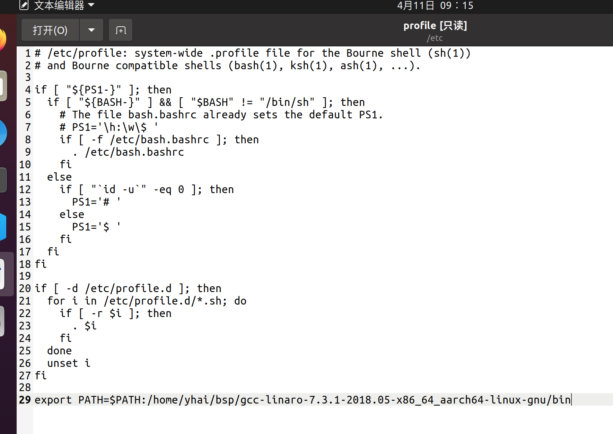

公司电脑搭建成功
家里电脑：

/*********************************************************/
2023/9/20
开始学硬件控制这周内容(需要板子，家里学)
/*********************************************************/
2023/10/11
继续学习硬件控制
环境搭建：
VSCODE装 PlatformIO IDE
 

问题： 连接不上github
1. 下载steam++(b站收藏了)
2. 下载steam++后，能够访问github，但是下载东西会报port 22 conection refused
3. 在 /Git/etc/ssh/ssh_config最后加上

        Host github.com
        Hostname ssh.github.com
        Port 443 
        user git

4. 问题解决 ，检查方法： ssh -T git@github.com


问题:虚拟机检测不到USB插入
1. 刷机时，发现检测不到板子，进而发现虚拟机检测不到USB
2. 解决办法:右键桌面上的计算机 此电脑-》管理-》服务，检查主机系统中VMware USB Arbitration Service能否正常启动。找到VMware USB Arbitration Service看看是否是正在运行，一般默认是手动启动。那么右键选择启动，直接重启虚拟机就能看到上文的USB设备了。

原文链接：https://blog.csdn.net/weixin_41789973/article/details/108624571
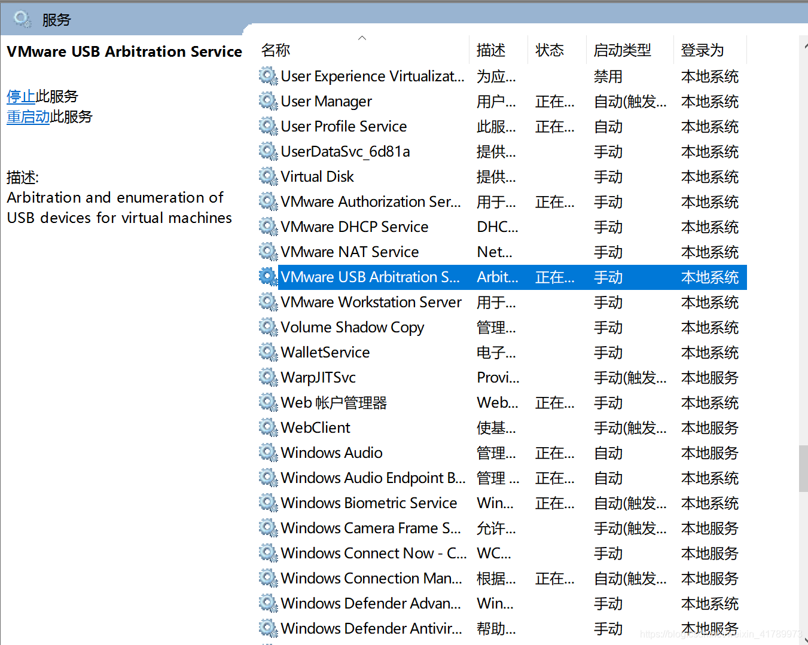

问题:刷机时报return value 8,刷机失败
解决办法:重新进入恢复模式，再次刷机成功，类似问题可查NVIDIA论坛，论坛网址:

构建源码目录：
```c
tar -xvf 	Jetson-210_Linux_R32.6.1_aarch64.tbz2 //它是英伟达提供的BSP框架（不包括源码包）
$ tar -xvf public_sources.tbz2 //public_sources是英伟达提供的从BSP框架中独立出来的内核源码压缩包。
$ cd Linux_for_Tegra/source/public
$ tar -xvf kernel_src.tbz2  //解压Linux内核(解压后生成 kernel  和 hardware )
                             //hardware 是独立出来的硬件信息部分，包括设备树和头文件
$ sudo tar -xvf Tegra_Linux_Sample-Root-Filesystem_R32.6.1_aarch64.tbz2  -C ~/bsp/Linux_for_Tegra/rootfs   //解压rootfs到对应目录
```


2023/10/20
框架图
CPU框架
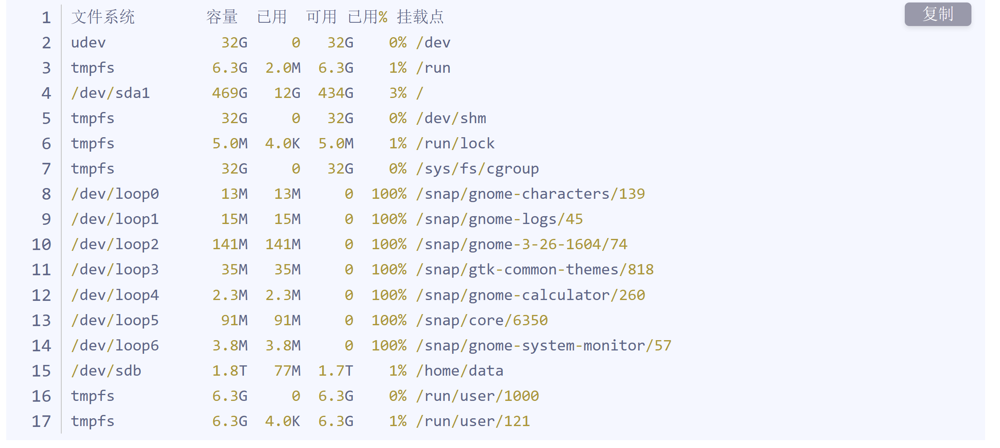

图错了

I 48 D$ 32 //48K指令和32数据  一级缓存（cache）

L1(2M)  //2MB共享的二级缓存

NEON  //一种基于SIMD(单指令多数据流指令)的arm技术-->矩阵运算、图像处理

GIC  //Generic Interrupt Controller 通用中断控制器 

CoreSight //片内黑匣子 ->不用jtag调试 追踪

          //通过专有的硬件非入侵地实时记录程序执行路径和数据读写信息，然后压缩成Trace数据流
          
          //恢复程序运行信息后，就可以进行调试和性能分析


图错了


总线：
AXI(Advanced eEtensible Interface) //高级可扩展接口（多通道并行）->与GPU FPGA的大数据传输

APB(Advanced Peripehrial Bus) //高举外围总线（单通道）->用于低带宽设备（如uart i2c）

AHB(Advanced Hing Performance Bus) //高级高性能总线（单通道）->高性能高时钟频率场景 

    //如ARM核与内部RAM、NAND FLASH、DMA、Bridge的连接

存储：

PCIE: Peripheral Component Express 周边设备高速互联，连接如WIFI高速设备

EMC: External Memory Controller 接外部存储器（如内存）的接口

MC: Memory Controller 内存控制器模块，处理来自内部客户端的请求并进行仲裁其中分配内存带宽

DDR: Double Data Rate SDRAM: 双倍速率同步动态随机存储器，即内存

LPDDR: Low Power Double Data Rate SDRAM:低功耗双倍数据速率内存

SATA: Serial Advanced Technology Attachment:接硬盘的常用接口


多媒体区：

VI: Video Input 视频输入

VIC:Video Image Compositor 视频图形合成

NVENC: NVIDIA Video Encoder Engine 视频编码引擎

NVDEC: NVIDIA Videod Decoder Engine 视频解码引擎

NVJPG: NVIDIA 的jpg图片的处理

TSEC:  Tegra Security Co-processor 一种嵌入式安全处理器，主要用于管理HDMI链路上的HDCP加密和密钥

ISP: Image Signal Processor 图像信号处理器，是相机处理硬件引擎管道

MIPI: Mobile Industry Processor Interface 移动行业处理器接口（一些移动设备的标准接口）

CSI: Camera Serial Interface 摄像头串行接口

DSI: Display Serial Interface 显示串行接口

eDP: Embedded Display Port 嵌入式显示端口

HDMI High-Definition MUtimedia Interface 高清晰度多媒体接口


2023/10/26

GPIO点灯（在硬件层）

    pin 12(丝印) ->I2S0_SCLK  //参考2.1板子标注说明

    -> GPIO3_PJ.07 //参考 4.2 40PIN外接管脚的转换表

    -> GPIO Controller 3 -Port J //参考3.1CPU芯片手册

    -> GPIO_CNF_1 204 //第三组GPIO的J端口的配置寄存器的偏移地址是204


GPIO点灯（在内核层）

分层映射（应用层  内核层  硬件层）

不同的层有不同的地址空间
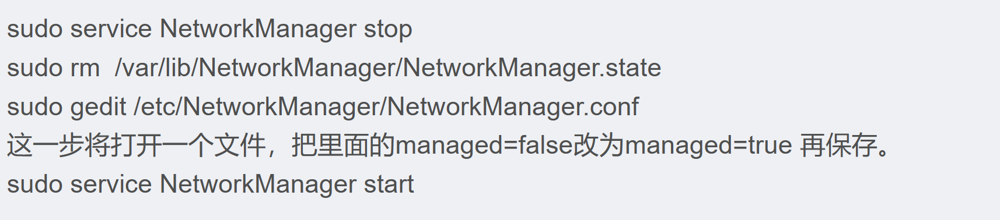

图错了


2023/10/27

    sudo insmod led.ko  插入驱动模块
    dmesg      查看内核输出日志
    sudo rmmod led 卸载驱动模块

通过应用层控制GPIO

    sudo insmod led.ko  //插入驱动模块时，查看信息
    dmesg //查看内核输出
    echo 79> /sys/class/gpio/export  //导出79号gpio引脚，使得可在应用层访问
    echo out> /sys/class/gpio/gpio79/direction //设置为输出
    echo 1> /sys/class/goio/gpio79/value  //输出高电平 开灯
    sudo rmmod led //移除led模块
    dmesg   //查看内核输出
    echo 0> /sys/class/gpio/gpio79/value  //输出低电平，关灯
    sudo insmod led.ko  //插入驱动模块时，查看信息
    dmesg   //查看内核输出


2023/11/8


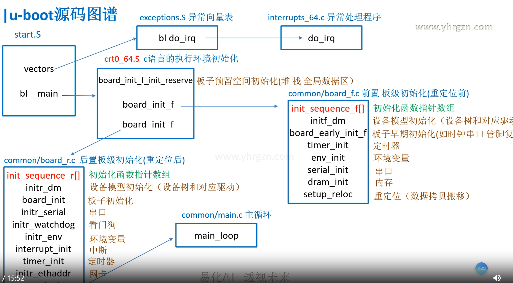


USB架构
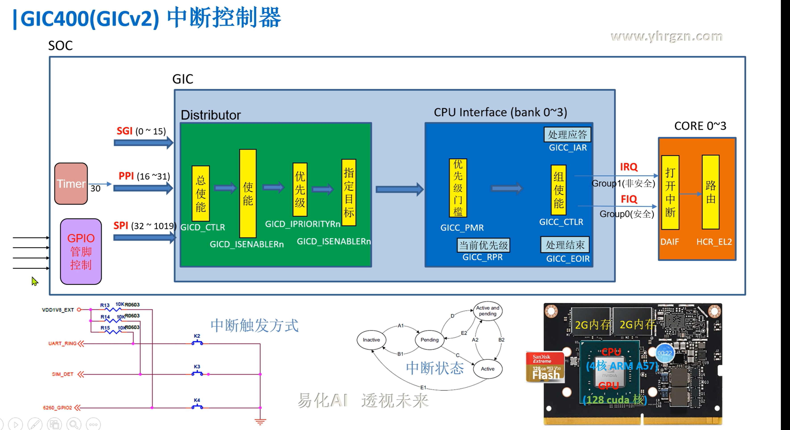

网卡工作原理
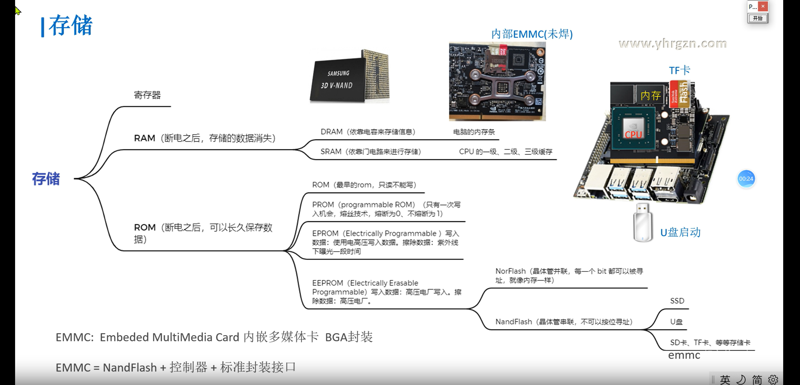


2023/11/14 串口
配置顺序
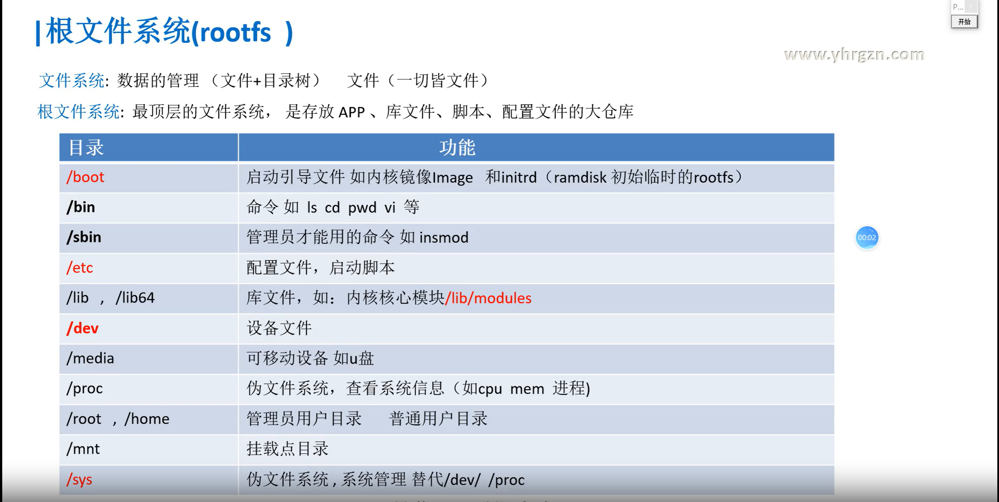
参考芯片手册guidline


2023/12/1 Uboot环境变量

    #pri   //输入pri的命令，查看uboot环境变量

    #setenv ipaddr 192.168.9.33  //设置环境变量

    #saveenv   //保存环境变量

    #pri   //查看

Uboot常用指令

    #pci enum;pci

    #tftp u-boot.bin

    #go 0x84000000

    #md    //memory display

    #mw    //memory write 


2023/12/4 I2C

1.BUS Clear 

当从机因未知原因持续拉低SDA,主机收到ARB_LOST(ARB_LOST有很多触发原因，需要确认是因该原因导致的);主机触发BUS Clear operation to recover i2c bus


2023/12/5 Uboot 编译

    $ make distclean 

    $ make p3450-0000_defconfig  /*配置u-boot为jetson nano板子的  

通过qemu调试

不能在应用层直接运行U-boot和内核   //地址空间不同

但可以用模拟器在应用空间模拟调试

不能用 gdb vmlinux调试内核，因为在应用空间，不能运行内核空间的程序

可以用户模拟器qemu来做，在应用空间模拟一个完整的系统

1.安装qemu 
```c
    $ sudo apt-get install qemu-system-arm
    $ qemu-system-aarch64 -h //查看全部帮助信息
    $ qemu-system-aarch64 --version //查看qemu版本
    $ qemu-system-aarch64 -machine help  //查看支持的machine
    $qemu-system-aarch64 -cpu help  //查看machine支持的cpu类型
```

可能存在报错的原因

版本太老，不支持A57 需源码编译

启动内核时会报错

2.源码编译qemu
用ubuntu自己下载的版本太老，选择用源码编译的方式安装最新的

https://www.qemu.org/download/ 下载最新的稳定版本 qemu-6.2.0-rc2.tar.xz 

板子上直接下载：
wget https://download.qemu.org/qemu-6.2.0-rc2.tar.xz
./configure  //配置，会报错，缺少一些软件需要安装


qemu 调试U-boot


2023/12/11
1.早上来发现ubuntu黑屏，最后发现原因，根目录挂载满了，解决办法
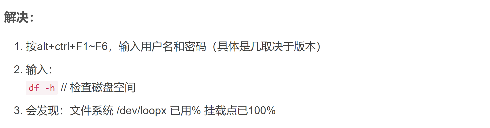


2.发现网络没了，通过ifconfig发现网卡关闭,解决办法如下


给根目录扩容
不会搞，放弃

下载u-boot.bin

u-boot源码分析

_weak:

    其实函数名称前面加上 __weak 修饰符，我们一般称这个函数为“弱函数”。假如工程中存在了一个__weak 修饰符的函数，用户还可以在工程中重新定义一个与之同名的函数，最终编译器编译的时候，会选择没有__weak 修饰符的函数，如果用户没有重新定义新的函数，那么编译器就会执行 __weak 声明的函数，并且编译器不会报错
 
 宏定义一般在.config里面查看
 u-boot源码框架
 

链接脚本：
有许多同名函数，要确定哪个参与编译的话，查看u-boot.map文件，能看到是哪个参与了编译

2023/12/19
u-boot 驱动开发
1.在u-boot命令菜单加入yhai命令
a.首先在cmd文件夹里编写yhai.c,代码如下
```c
    #include <common.h>
    #include <command.h>

    static int do_yhai(struct cmd_tbl *cmdtp, int flag, int argc, char *const argv[])
    {
        int i;
        printf("do yhai cmd \n");
        for(i=0;i<argc;i++)
        {
            printf("argv[%d]=%s\n",i,argv[i]);
        }
        asm volatile(svc #0);  
        return 0;
    }

    U_BOOT_CMD(
        yhai, CONFIG_SYS_MAXARGS, 1, do_yhai, //command name, max factors,1 means enter can rerun this command
        "yhai add cmd test",  //#help can see this description,for exmaple: yhai -- yhai add cmd test
        "yhai arg"  //#help yhai      
    );
```
b.然后cmd文件夹里的Makefile里加入一行

    obj-$(CONFIG_CMD_YHAI) += yhai.o

c.然后在cmd文件夹里的Kconfig文件里加入
```c
    config CMD_YHAI
        bool "yhai_cmd"
        default n
        help
            yhai do cmd
```

d.然后在make menuconfig,进入cmd interface里选中yhai，然后保存退出make


2.在C语言程序里加入汇编指令
```c
    asm volatile(svc #0);   //嵌入式汇编代码

    /*
    asm:声明是嵌入式汇编 
    volatile:声明是易变的，避免编译器优化
    svc #0 ：触发0号中断（同步异常）
    #运行后看到 Synchronous Abort信息输出，说明同步异常有触发
    详见 arch/arm/lib/interrupts_64.c的do_syc
    */
```  
3.传参
```c
    void inc(x)
    {

        int y;

        asm volatile("add %w0,%w1, 1":"=r" (y):"r"(x):);

        return y;

        //(代码：输出列表：输入列表)
        // r:编辑为寄存器 =：只读 w:32位  %0：指代第一个参数（如y） %1"指代第二个参数（如x）
    }
```

中断


中断源种类

SPI(Shared Peripheral Interrupt 32-101) //外设触发的中断，可多核共享

SGI(Software Generated Interrupt 0-15)//软件触发的中断，用于多核间通信

PPI(Private Peripheral Interrupt 16-31)//CPU核私有的中断（如定时器中断，非安全模式下ID为30）
中断状态 //Inactive-active-pending

分发

distribution

集中管理所有中断源，把最高优先级的中断源，分发给对应的CPU接口
负责：各个子中断使能，设置触发方式，优先级排序，分发到哪个CPU

    GICD_CTLR //分发总使能， bit0=1 enable
    GICD_TYPER //该GIC能够支持最多多少个IRQ硬件中断源（如ITLinesNumber(4-0)=0xb）->最大支持12*31-1=384个IRQ
    GICD_ISENBALERn //使能指定中断源（32位对应32个中断源，Rn:超过32个时）
    GICD_ICENABLERn//清除使能
    GICD_IPRIORITYRn //每八位对应1个中断的优先级，0-255，越低优先级越高
    GICD_ITARGETSRn //每八位对应1个中断要分发到那些CPU(bit0=1 分发cpu0 bit1=1 分发cpu1 ......bit7=1 分发cpu7)
    GICD_IGROUPRn//决定中断时group0,还是group1 (0:group0 1:group1)

CPU接口

        CPU Interfaces //负责发送给CPU核，和中断状态的维护
        GICC_CTLR //打开GIC CPU interface总中断（EnableGrp1 bit1=1）
        GICC_PWR //优先级门槛，只有比该优先级高的才能通过
        GICC_RPR //记录正在处理的IRQ的优先级别，主要用来中断抢占使用的
        GICC_IAR //正处理中断的回答（ID号），CPU读取并处理，并把对应的IRQ状态从PENDING变为ACTIVE
        GICC_EOIR /中断处理完成，写入对应的中断ID号，表示IRQ处理结束，IRQ状态变为DE-ACTIVE

CPU核1
```c
CPU core //负责程序的执行和数据的处理
DAIF //中断屏蔽位（为1时屏蔽）
    // bit[9:6]: D A I F D(断电观察点) A（SError） I(IRQ) F(FIQ)

HCR_EL2 //路由使能
        // IMO, bit[4] Physical IRQ Routing
        //当是el2状态时，需IMO=1,打开路由使能，才接收物理的中断信
```

存储


    EMMC: Embeded MultiMedia Card 内嵌1多媒体卡 BGA封装
    EMMC = NandFlash + 控制器+ 标准封装接口

根文件系统


文件系统：数据的管理（文件+目录树）  文件（一切皆文件）
根文件系统：最顶层的文件系统，是存放APP、库文件、脚本、配置文件的大仓库

    /proc:伪文件系统，查看系统信息（如CPU、men进程）
    例：cat cpuinfo  cat memiofo 

2023/12/28
文件系统类型

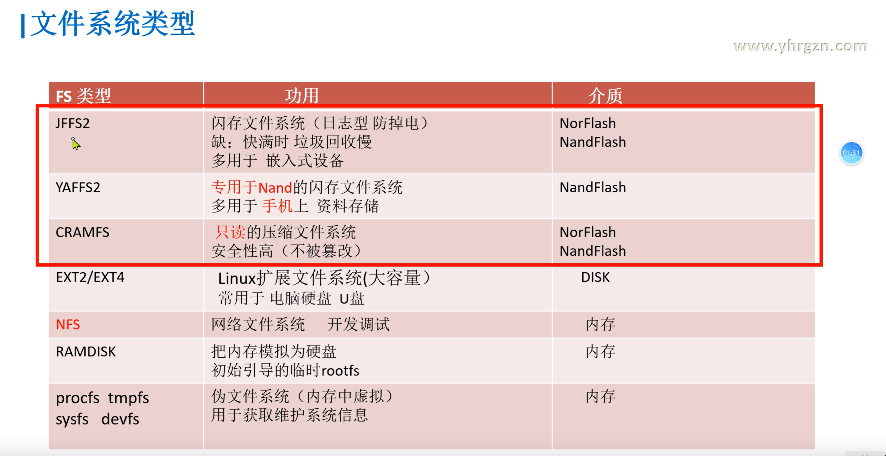

NFS:主要用于开发调试
 

最小系统

用BUSYBOX制作最小根文件系统

file busybox 查看文件类型

确保生成的是arm类型的

ls -l linuxrc 


linuxrc是上电运行的第一个程序，解析相关的配置文件

BUSYBOX制作最小根文件系统流程

1.官网下载 https;//busybox.net/
    或者   wget  https://busybox.net/downloads/busybox-1.34.1.tar.bz2 //最新稳定版

1.   tar -xvf busybox-1.34.1.tar.bz2 //解压
2.   cd busybox-1.34.1
3.   make menuconfig
4.   在Setting里面，选中 [*]Build static binary(no shared libs)
5.   在Setting里面，添加交叉编译工具 Cross compiler prefix (aarch64-linux-gnu-)
6.   make //编译
7.   file busybox //检查生成的类型
8.   make install
9.   mkdir dev etc var proc tmp home root mnt sys
10.  cp -rf ../examples/bootfloppy/etc/* etc/   //拷贝最简的示例配置
11.  cp /home/yhai/bsp/gcc-linaro-7.3.1-2018.05-x86_64_aarch64-linux-gnu/aarch64-linux-gnu/libc/lib/  . -a   //拷贝编译工具链里的库  (核心，库文件编译工具链提供)
12.  du -m lib /查看lib库大小
13.  lib库裁剪，  rm lib/*.a  //删除静态库文件
14.  aarch64-linux-gnu-strip lib/*  //裁剪掉库里的调试信息
15.  rm -rf lib/debug
16. sudo mknod dev/null c 1 3 
17. sudo mknod dev/console c 5 1
注：17是建立空设备文件夹，18是串口的文件夹，不建立可能串口不输出打印信息

网络文件系统

安装NFS服务

    sudo apt install nfs-kernel-server
    sudo systemctl status nfs-server  //查看服务是否启动

    sudo mkdir /nfs
    cp _install -rf /nfs/rootfs
    sudo chmod 777 -R /nfs
    sudo gedit /etc/exprots  //修改配置文件，指定共享目录位置
    在文件末尾追加
    /nfs/rootfs *(rw,sync,no_subtree_check)

    rw 允许读写

    sync 文件同时写入硬盘和内存

    no_subtree_check 即使输出目录是一个子目录，nfs服务器也不检查其父目录的权限，这样可以提高效率

    sudo systemctl restart nfs-server  //重启服务（使得前面的配置修改生效）

    自环测试：将/nfs/rootfs挂载到/mnt下
    sudo mount -t nfs localhost:/nfs/rootfs/ /mnt/   //测试nfs服务是否安装成功

    sudo umount /mnt   //解除挂载

    nfs服务开机启动
    sudo systemctl enable nfs-server
    nfs服务开启
    sudo systemctl start nfs-server
    nfs服务关闭
    sudo systemctl stop nfs-server

2023/12/29
板子从NFS启动

1. 通过putty为板子设置环境变量 
   
        setenv bootargs root=/dev/nfs rw nfsroot=192.168.9.119:/nfs/rootfs,v3 console=ttys0 115200 init=/linuxrc ip=192.168.9.9

        //bootargs:启动参数，传递给内核的

        //root=/dev/nfs :指定rootfs所在的设备是NFS

        //nfsroot=192.168.9.119 :nfs/rootfs的位置（是在ip是192.168.9.120的机器上的nfs/rootfs目录下）注意/nfs/rootfs必须和前面nfs服务配置文件设置一致

        //console=ttys0,115200 指定内核启动后串口信息从串口0输出，波特率115200（设置错，将导致没有内核信息输出）

        init=/linuxrc 指定第一个应用程序
        ip=192.168.9.9  需设置为板子自己的IP
2. saveenv   //保存
3. pri bootargs //查看bootargs参数
4. pci enum;pci  //激活网卡
5. fstype mmc 1:1  //查看emmc设备（flash） 1号设备的1号分区
6. ext4ls mmc 1:1  //查看emmc设备的目录和文件信息
7. ext4load mmc 1:1 0x84000000 /boot/Image  //读ext文件系统中的/boot/Image到内存0x84000000
8. ext4load mmc 1:1 83100000 /boot/tegra210-p3448-0002-p3449-0000-b00.dtb
9.  booti 0x84000000-83100000  //启动Image格式的内核
     //booti : 引导ARM64 Kernel image---- Image
     //bootz : 引导ARM kernel image-----zImage
     //bootm : 引导u-boot自定义的kernel image---uImage


系统配置脚本：
    1. /nfs/rootfs/etc$ cat inittab  #this is run first except when booting in single-user mode
    2. 输入第一条命令，会出现 ::sysinit:/etc/inti.d/rcS //指定系统初始化脚本是rcS  也可指定别的名字，但习惯用rcS
    3. ::askfirst:-/bin/sh   //需要按enter键，才能进入shell
    4. ::restart:/sbin/init  //stuff to do before rebooting
    5. ::ctrlaltdel:/sbin/reboot //ctrlaltdel:软启动

启动脚本
1. /etc/init.d/rcS  //启动脚本位置 rcS是第一个初始化的脚本
2. #！ /bin/sh   //指定它是一个shell脚本，固定的格式
3. /bin/mount -a //挂载/etc/fstab文件指定的所有文件系统
4. #etc/init.d/rc.local  //扩展子脚本
5. echo /sbin..mdev > /proc/sys/kernel/hotplug  //设置系统的有热插拔设备时，调用mdev程序
6. /sbin/mdev -s  //mdev 系统启动和热插拔  或动态加载驱动程序时，自动产生驱动程序所需的节点文件
7. #./app.exe  //可添加自己的程序，让其上电自己运行
8. ./main.c 
9. /sbin/ifconfig eth0 192.168.9.18  //启动后自动配置ip
10. $ chmod +x init.d/rcS  //添加可执行权限
11. 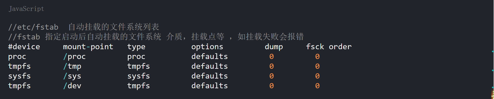
    
系统环境变量的设置  /etc/profile
1. #！bin/sh
2. export HOSTNAME=yhai
3. export USER=root
4. export HOME=root
5. export PS1="[$USER@HOSTNAME \w]\#"
6. PATH=/bin:/sbin:/usr/bin:usr/sbin
7. LD_LIBRARY_PATH=/lib:/usr/lib:$LD_LIBRARY_PATH
8. export PATH LD_LIBRARY_PATH

上电后应用程序自动执行  /etc/rootfs
```c
    #include <stdio.h>
    int main(void)
    {
        printf("hello world");
    }
```
RAMDISK 虚拟磁盘

虚拟内存盘，把RAM模拟为硬盘来使用的技术
//速度快，但掉电信息丢失（但也能避免信息篡改，把最简的rootfs内容做成ramdisk）

制作RAMDISK
1. cd /nfs
2. dd if=/dev/zero of=ramdisk.img bs=1k count=8192
3. 注：dd--用于创作磁盘的命令 if(input file) of(output file) 最终效果：创建了一个空的磁盘（8M），这个大小要跟内核里的设置一样
4. mkfs.ext2 -i 8192 ramdisk.img -d rootfs
5. 注： -d--输入内容
6. gzip -9 -f ramdisk.img  
7. 注：某种方式压缩
8. du -h ramdiks.img.gz

板子上加载RAMDISK


Linux内核
Linux系统(os)=kernel+fs ,集内核，工具集，各种库，桌面管理器 应用程序为一体的发布包

例：Debian ubuntu Red Hat Fedora CentOS

Linux内核（kernel）
是Linux系统的底层核心功能，负责底层硬件打交道，主要有五大模块

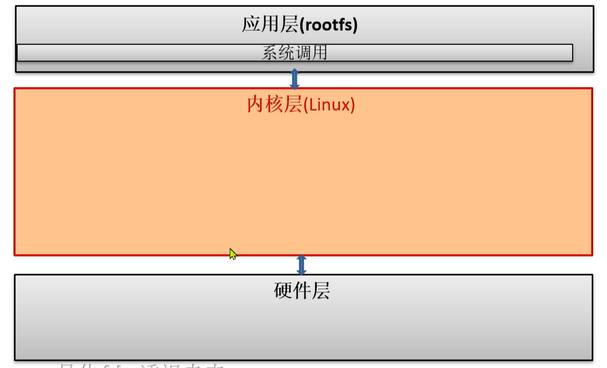


Linux内核特性
1. 免费开源
2. 可以移植，支持的硬件平台广泛
3. arm,arm64,powerpc,mips,avr,x86
4. 高扩展性
5. 可剪裁，可扩展，可以运行在大型主机，也可以运行在个人计算机上
6. 高可靠性、稳定性
7. 稳定性是linux鲜明特点，安装了linux系统的主机
8. 连续运行一年不宕机是很平常的事情
9. 超强的网络功能
10. 真正的多任务，多用户系统
11. 模块化设计
12. 模块可以动态加载，卸载，可以减少系统体积，同时可以用来解决冲突问题，模块调试

Linux内核版本

1. cat/proc/version
2. Linux 5.13.0-30-generic
3. 第一个数字5：主版本号
4. 第二个数字13：次版本号
5. 第三个数字0：修订版本号
6. 第四个数字30：当前内核版本的第30次微调patch

Linux内核源码目录

1. arch: CPU系统结构：如arm powerpc misps x86 avr arm64
2. block: 块设备的上层代码:存储设备如（硬盘，nandflash SD卡）
3. crypyo: 加密功能，如压缩和CRC校验，SHA1加密算法
4. Document: 内核帮助手册，如设备树的文档
5. drivers:驱动，如网卡 摄像头 u盘 flash i2c等的驱动程序
6. fs:文件系统，如ext2 jffs2 yaffs2 sysfs
7. include:头文件，include/asm平台特有 include/linux是通用的
8. Init:内核的初始化，如init/main.c
9. ipc:进程间通讯：如共享内存和信号量
10. kernel:内核调度算法
11. mm:内存管理
12. net:网络协议，如TCP/IP
13. lib:通用库：如strlen和memcpy之类通用库函数
14. firmware:固件，二进制程序（固化在设备内运行的）只是读与写
15. sound：声卡驱动

Linux内核启动分析

三大步

引导---内核初始化---过渡到rootfs

引导
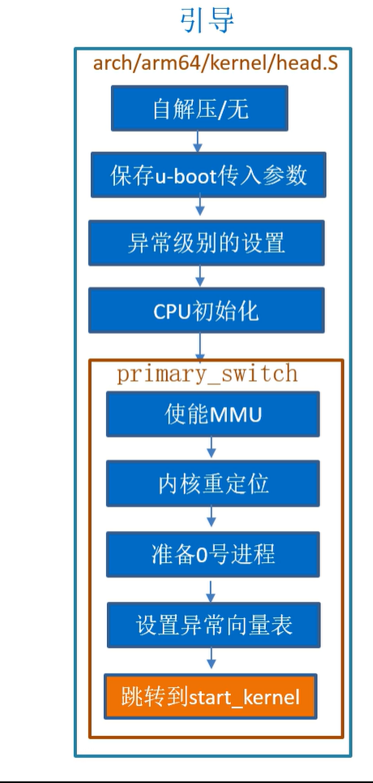

第一个文件： arch/arm64/kernel/head.s

1. 自解压 ：32位常用，jetson nan不用
2. 保存u-boot传入参数（例：用的哪个串口终端;bootargs参数）
3. 异常级别的设置 一般进入EL2
   EL0:应用层
   EL1:内核
   EL2:虚拟化技术
   EL3:安全固件模式
4. CPU初始化
第二个文件 primary_switch
5. 使能MMU（内存管理单元）
6. 内核重定位（地址空间变化了）
7. 准备0号进程
8. 设置异常向量表
9.  跳转到start_kernel

内核初始化
init/main.c->start_kernel
1. 内核版本信息
2. 体系结构和设备树安装
3. 安装命令行参数（u-boot传入bootargs）
4. 系统调用初始化
5. 内存管理初始化
6. 内核调度初始化
7. 中断 时钟 定时器初始化
8. 控制台 进程 初始化
9. 跳转到rest_init

过渡到rootfs
init/main.c->rest_init
1. 创建内核线程
2. 1号进程（init）-->驱动初始化-->驱动模块初始化-->运行第一个应用程序(如命令行参数指定的进程 Init=/linuxrc)

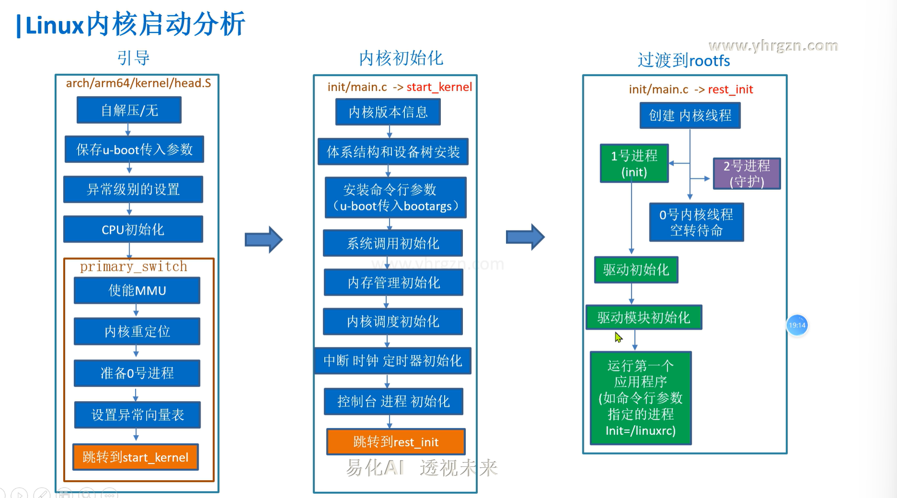


内核源码跟踪
1. 查看System.map寻找第一个运行的   (_text)


内核移植
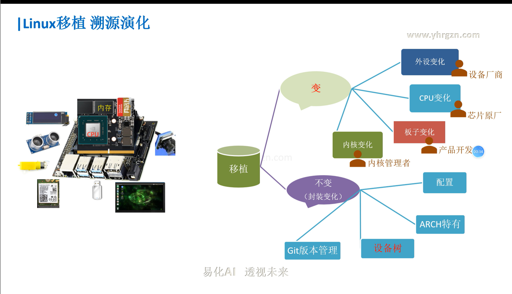


源码配置编译

菜单配置
make menuconfig 显示的是.config文件的图形化界面 
1. make ARCH=arm64 tegra_defconfig //导入官方配置
    //会从 arch/arm64/configs下查找tegta_defconfig，导入到当前目录，重命名为.config
2. 从零开始配置，首先删除原配置， mv .config .config.ago
3. make menuconfig ARCH=arm64 //生成最初始配置界面（如不指定ARCH,，默认的是x86的）当前目录有.config则导入，如无则用默认x86配置生成.config
4. make savedefconfig //生成defconfig(相比make menuconfig里的SAVE保存的配置，这是最简的)
5. cp defconfig arch/arm64/configs/yhai_defconfig


编译
1. make //编译所有
2. make Image //只编译内核
3. make mudules // 只编译模块
4. make dtbs  //只编译设备数
5. make install //安装内核
6. make modules_install  //安装模块 需要指定安装路径
7. make clean  //清除编译中产生的临时文件
8. make ditclean  //清除所有文件（临时文件+配置）

菜单配置的实现
1. 源码在顶层目录的Kconfig
2. source "arch/$SRCARCH/Kconfig"  //导入子Kconfig

当前的配置文件
1. menuconfig之后生成了.config
2. Makefile在编译时通过读取.config决定谁参与编译

配置头文件

1. include/generated/autoconf.h  //配置头文件（编译后自动生成的）
2. 通过该文件，可知当前生效的配置是哪些, .h文件是给源码用的

源码编译的实现

1. Makefile编译原则：时间最新 依赖
2. 变化的文件时间上就是最新的文件，找到最新的文件，重新编译该文件以及依赖该文件的文件

顶层管理

1. 顶层Makefile，负责总体内核的编译连接
2. ARCH   ?=$(SUBARCH)  //指定zrch(如传参 make ARCH=arm64) 如不指定默认x86
3. CROSS_COMPILE ?=$(CONFIG_CROSS_COMPILE: "%"=%)  //指定交叉编译工具链 （如传参 make CROSS_COMPILE=aarch64-linux-gnu-）
    
    强制写死： CROSS_COMPILE ?=aarch64-linux-gnu-

    LD   =$(CROSS_COMPILE)ld

    CC   =$(CROSS_COMPILE)gcc

1. 指定源码子目录
    drivers-y :=drivers/sound/firmware

    core-y    +=kernel/certs/mm/fs/ipc/security/crypto/block

    srctree := .   //指定源码树顶层目录

    objtree := .   //指定目标文件树顶层目录

    include arch/$(SRCARCH)/Makefile  //指定导入arch的子Makefile 

2. PHONY :=_all //入口：默认的依赖目标：make时，递归查_all依赖文件
   //某文件不存在或有更改（时间最新），则把依赖它的文件都重新编译

3. all: mudules  //make all时，递归查modules的依赖
   %config: scripts_basic outputmakefile FORCE

4. echo :显示信息  


体系结构的管理

    arch/arm64/Makefile: 编译体系结构的Makefile
    负责本体系结构的相关代码编译  生成内核镜像

指定源码子目录

    core-y   +=arch/arm64/kernel/arch/arm64/mm
    core-$(CONFIG_NET) += arch/arm64/net  //$(CONFIG_NET)是当配置后，会变为y,或m -> 实现界面配置，那些源码编译或不编译

    KBUILD_IMAGE  :=Image.gz
    KBUID_DTBS    :=dtbs

    all:  $(KBUILD_IMAGE) $(KBUID_DTBS)  //入口

    boot := arch/arm64/boot  //指定存放Image的目录


子文件的管理

/init/Makefile


2024/3/25

刷整机
1. 参考  //https://docs.nvidia.com/jetson/archives/l4t-archived/l4t-3261/index.html -> 快速开始 -> 强制恢复模式

2. 载板 B01，J50 的引脚 9 和 10 需插入跳线帽 //位于 Jetson 模块下方的载板边缘，调试usb口的旁边
3. 用micro usb线，连接板子和电脑，板子重上电  //用usb线来刷机
4. $ lsusb   //如看到下面信息，表示进入了恢复模式
  Bus 003 Device 008: ID 0955:7f21 NVIDIA Corp

5. cd ~/bsp/Linux_for_Tegra
6. sudo ./flash.sh jetson-nano-qspi-sd mmcblk0p1  //刷整个镜像


刷完后初始设置

 没有显示器的情况下，去设置

 microUSB虚拟成串口，进行设置


双网卡并行
1. 一个无线网卡连外网，一个有线网卡连板子调试
2. 编辑---虚拟网络编辑器---更改设置---选VMnet1---桥接选择USB网卡---确定
    
    虚拟机---设置---添加---网络适配器---自定义---选VMnet1---确定

    虚拟机里，右上角，设置一个网卡，连接wifi上外网（wifi用DHCP），一个网卡，连接usb网卡(用手动分配网段，跟板子和主机网卡在同一网段)，连接板子


2024/3/27
有线网卡配置
1. 在菜单界面里面选配
2. make menuconfig --- command line interface --- Device access command
   --- pci

3. 找到  [*] Network device support 
                   [*]  Realtek 8169 seiries Ethernet controller driver

4. 配置PCI总线支持
            [*] PCI support 
                [*] Tegra PCI support


USB命令移植

1. usb infor //查看usb的设备信息
2. 通过测试usb命令，看是否需要移植usb命令。
3. 如果需要移植，比如先去找最新的uboot支持否，若支持，复制过来，修改makefile和kconfig

2024/3/28

设备树

一种描述硬件  连接信息的数据结构

采用结点（node）和属性（property）嵌套构成树形结构

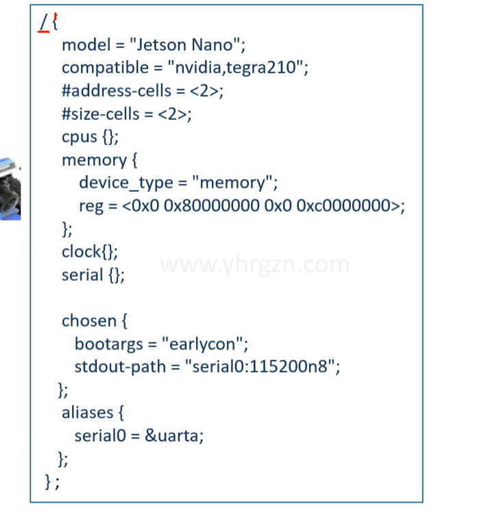

1. model与compatible用来找到该设备
2. /是根结点
3. #address-cells指起始地址为几个byte,#size-cells指长度为几个byte.
4. reg=<起始地址 长度>
5. chosen表示虚拟的，bootargs以uboot里设置的为第一优先级，uboot里没有设置，再读取设备树里面的
6. aliases表示别称

加载设备树

注意：加载自己新的设备树前，一定要清掉之前残留的设备树，
mw 83100000  0 50 : 从83100000开始写50个byte的0
cat /sys/firmware/devicetree/base/compatible  //查看当前加载的设备树的名字

如果加载CPU不匹配的设备树，start kernel后无信息输出
CPU相同的板子，挂载设备树，大概率成功

设备树加载解析

bd //检测板子信息
arch_number =0x0000000000000000  机器码（板子ID）---在uboot和内核之间今夕对比适配

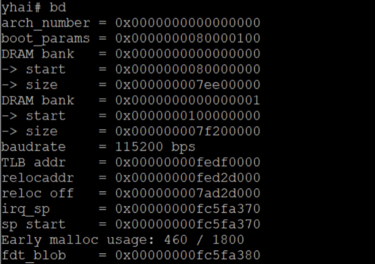
内核启动后 start kernel报检测id错误 Error: unrecognized/unsupported machine id，就是这个不匹配造成的（32位在用，64位取消了该检测）

booti 0x84000000 - 83100000  //0x84000000为内核地址，-表示忽略ramdisk地址，83100000为设备树地址
 

 2024/4/1
 虚拟机扩容
 1. df -h 查看挂载点信息
 2. sudo fdisk -l 查看硬盘信息
 3. ls -lh /dev/disk/by-uuid 查看硬盘uuid
 4. sudo mount /dev/sdb1 /home/yhai/bsp
 5. 开机自动挂载
   sudo gedit /etc/fstab  在最后一行加上
   UUID=cf557822-f92e-48a1-bb4f-e93d2f4f5702  /home/yhai/bsp 	    ext3    defaults       0       1


从零开始写设备树文件
1. 代码见 yhai.dts
2. 编译：修改makefile 
   最后一行加入 dtb-y+=yhai.dtb
3. cat/sys/firmware/devicetree/base/compatible  查看设备树信息，是不是最新的（很关键，因为有可能下载失败，使用的是残存的设备树）


2024/4/9

网卡移植

移植思路顺序：
内核配置（menuconfig 选配）---设备树修改

2024/4/10
内核模块三要素
```c
#include <linux/kernel.h>//内核模块常用头文件
#include <linux/module.h>//内核模块常用头文件
1. module_init()  //内核模块的加载入口声明
2. module_exit()  //内核模块卸载入口
3. MODULE_LICENSE("GPL); //免费开源声明
4. MODULE_AUTHOR("scx");  //可选，模块作者声明
```
设备驱动的分类

1. 字符设备：按字节流顺序传递，如串口，键盘，鼠标等
2. 块设备： 按块随机访问
3. 网络设备 ：基于TCP/IP协议栈

设备驱动框架

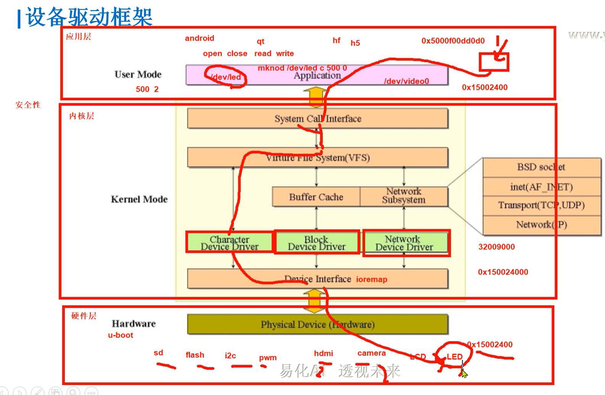


用户层到内核层：在/dev下找到对应设备文件，然后执行读，写等操作
内核层到硬件层：ioremap完成地址映射

字符设备驱动顺序
1. 注册设备号
2. 初始化字符设备
3. 实现设备的文件操作(open,read,write,close,ioctl(cmd))


平台设备

集成在soc系统中的设备
从resource角度统一起来抽象为platform设备
IORESOURCE_MEM
IORESOURCE_IRQ

    struct resource{
        resource_size_t start;  //起始地址
        resource_size_t end;    //结束地址
        unsigned long flags;    //资源类型，memory,IRQ等
    }

GPIO子系统

    yhai-led-gpiod{
        compatible = "yhai,led_gpiod";
        status = "okay";
        gpios = <&gpio TEGRA_GPIO(J,7) GPIO_ACTIVE_HIGH>;
        //引用gpio节点的设置，参数个数为2，由gpio-cells = <2>;决定
        //第一个参数 TEGRA_GPIO(J,7) 是GPIO号  详见设备树文档 tegra186-gpio.txt
        //第二个参数  GPIO_ACTIVE_HIGH 是电平极性  HIGH表示 1为高电平，0位低电平;反之，low,1为低电平
    };

用了GPIO子系统，控制管脚输出高低，直接set 1就好了，底层相当于封装了


设备树自定义属性
1. 需要包含头文件 
```c
    #include <linux/device.h>
    #include <linux/of.h>
```
2.   
```c 
    struct device_node *np=pdev->dev.of_node;          
     of_property_read_string(np,"yhai_addr",&name);
    of_property_read_u32(np,"yhai_age",&tmp);
```
3. 设备树里加上自定义节点，yhai_addr和yhai_age 
统一设备模型

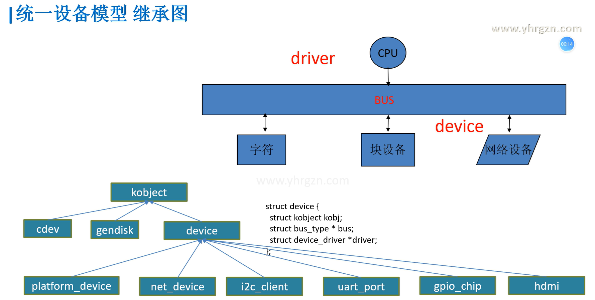

GPIO子系统和PinCtrl子系统
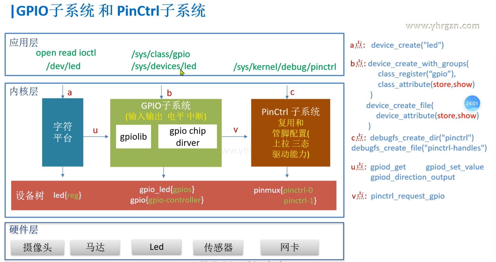

i2c子系统
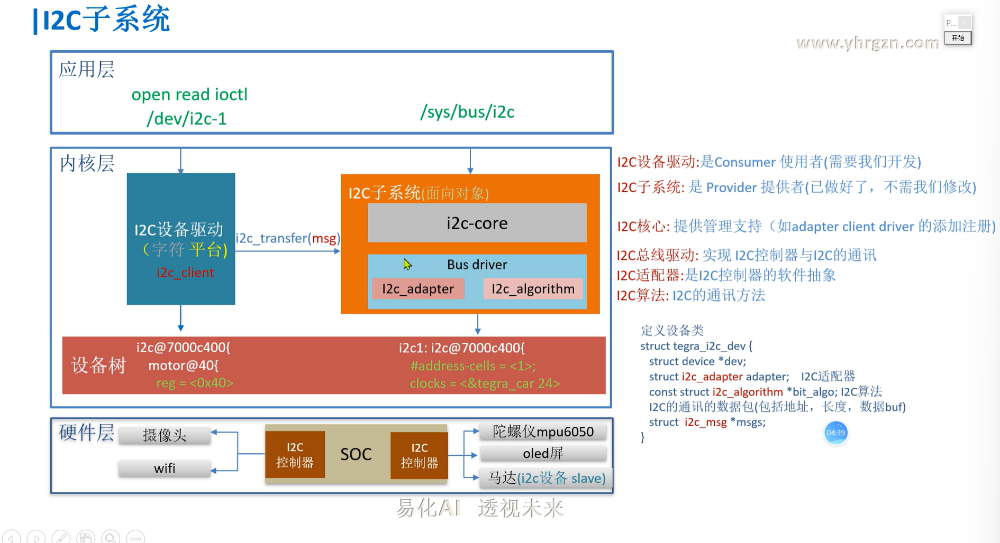

中断机制

1. Linux将中断分为上半部和下半部，上半部处理紧急的任务;有耗时间的中断时才需要下半部；上下半部是人为分的；上半部优先级相同，先到先处理。
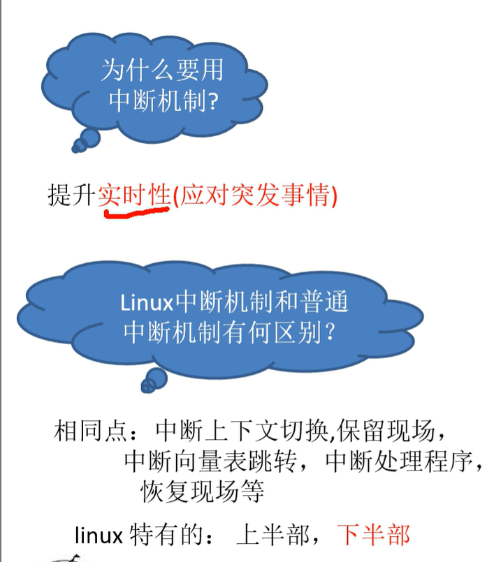

2. 下半部可能用到的 TASKLET_SOFTIRQ :优先级位于下半部末尾，用于中断推迟执行，运行于中断上下文，不可睡眠1
3. work_queue用于任务推迟执行，运行于进程上下文，可睡眠
4. ksoftIRQ:内核线程，最低优先级。
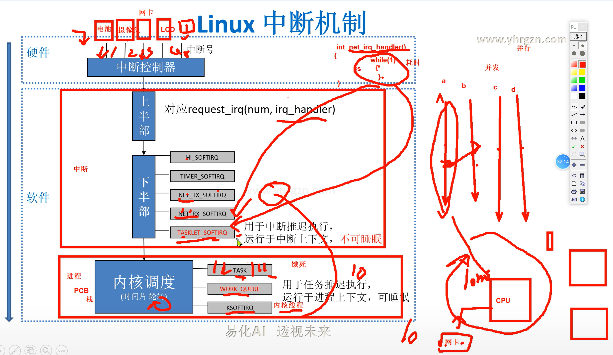
5. (1)如果一个任务对时间非常敏感，将其放在上半部中执行
   (2)如果一个任务和硬件有关，将其放在上半部执行
   (3)如果一个任务要保证不被其他中断打断，将其放在上半部中执行
   (4)如果中断要处理的工作本身很少，所有的工作都可在上半部全部完成
   (5)其他所有任务，考虑放置在下半部执行
6. 举例分析:当网卡接受到数据包时，通知内核，触发中断，所谓的上半部就是，及时读取数据包到内存，防止因为延迟导致丢失，这是很急迫的工作。读到内存后，对这些数据的处理不再紧迫，此时内核可以去执行中断前运行的程序，而对网络数据包的处理则交给下半部处理。
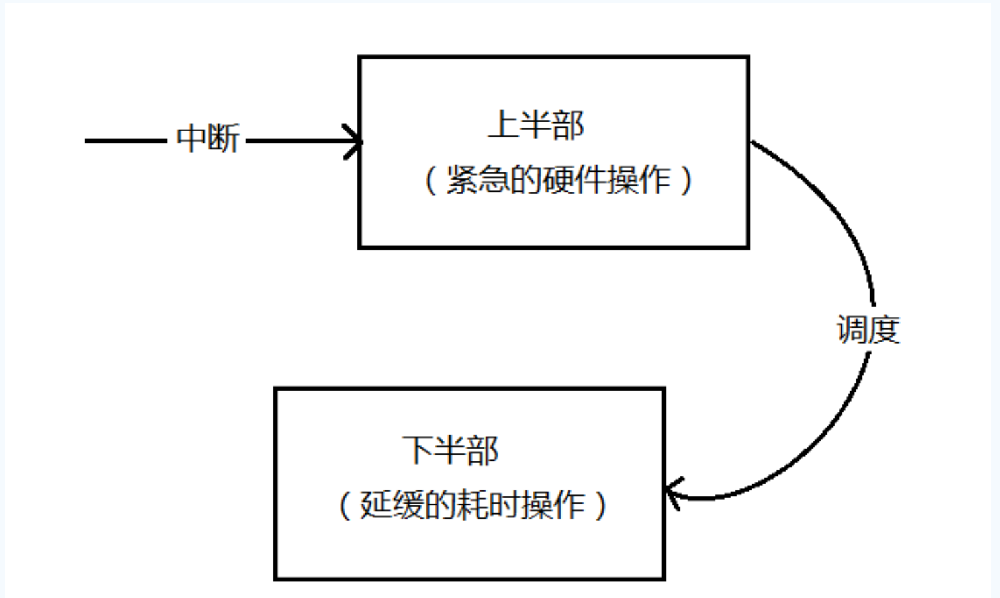

7. 下半部处理策略1：tasklet(任务)
    引入tasklet,最主要的是考虑支持SMP，提高SMP多个cpu的利用率;不同的tasklet可以在不同的CPU上运行。但是tasklet属于中断上下文，因此不能被阻塞，不能睡眠，不能被打断。


按键中断

```c
    //设备树里加上
    key_irq{
        compatible = "yhai_key_irq";
        key_gpio = <&gpio TEGRA_GPIO(J,1) GPIO_ACTIVE_HIGH>
    };
```

1. 选择管脚，因为要配成上升沿或下降沿触发中断，所以管脚本身要上拉，必须选择外接上拉的引脚。

Linux内核 时间把控

1. 时钟中断：外部晶振经过升频后，在cpu内部输出的周期性的脉冲信号（边沿触发）->滴答声（节拍）

2. Jiffies :time_before time_after:查询比较，看jeffies值到了没

3. 定时器(倒数计数): timer_list: 耗尽值（.expires）+回调（.function）

4. 内核调度（切换 并发）:schedule:调度CPU出去
                        schedule_timeout msleep :调度+超时限制（sleep指进程睡眠，CPU去处理其他进程）
                        schedule_timeout_interruptible:可被打断


中断禁用

```c
    local_irq_disable()  //禁用本地中断的传递
                          //local_irq_enable  恢复本地中断的传递
    
    local_irq_save(flags)   //保存当前中断状态后，再禁用本地中断的传递 ->
                            //比local_irq_disable更安全
    local_irq_restore(flags)  

    disable_irq(irq_num)    //禁用指定中断
                            //enable_irq(irq_num) 使能指定中断
                            
    注：屏蔽中断的时间尽量短，否则会造成别的中断延时过久，甚至丢失，最好能才用屏蔽指定中断的方式
```


并发控制

1. 串行 :顺序执行
2. 并发 :交替执行，伪同时
3. 并行 :同时执行

并发带来的问题

1. 竞争: 对资源的争抢 ->逻辑混乱
2. 互斥: 保证一个资源在一个时间只能被一个任务访问

并发控制的机制

1. 原子操作 :不可分割最小单元
2. 中断屏蔽 :关中断时间尽量短->有中断
3. 自旋锁(Spin_lock) : 忙等待->短，多CPU
4. 互斥锁(mutex_lock): 二元变量，会睡眠 ->多进程
5. 信号量: 资源计数 ->互斥同步
6. 读写锁: 只有读不互斥 ->读多写少会被写阻塞->只允许
7. 顺序锁: 读不会被写阻塞->只允许一个写
8. 读拷贝更新: 写时拷贝->读时也能写


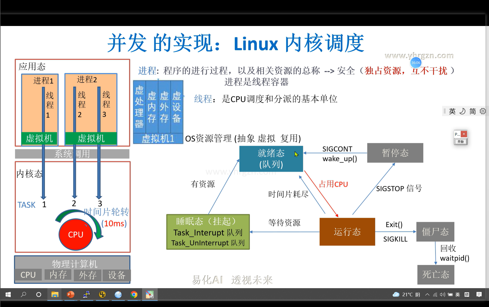


内核线程


虚拟内存


原子操作
```c
static atomic_t led_atomic = ATOMIC_INIT(1); //定义原子变量，并初始化为1

/*led_open里面写*/
if(!atomic_dec_and_test(&led_atomic)) //自减1，并测试是否为0
{
    atomic_inc(&led_atomic);  //原子变量+1,,恢复自检前状态
    return -EBUSY;  //已经被打开
}

/*led_release里面写 */
atomic_inc(&led_atomic);

```

自旋锁 
1. 上锁和解锁必须在同一个函数里面，并且上锁期间的代码必须非常短。
2. 可以用于中断，内部是忙等待，不会睡眠。
3. 可用于SMP多CPU之间的互斥。（只有自旋锁可以做到）
4. 比较耗资源。

```c
    #include <linux/spinlock.h>
    static DEFINE_SPINLOCK(slock);

    irq_handler()   //适合用于中断处理程序（spin_lock不会睡眠）
    {
        spin_lock(&slock); //为避免很卡，可用spin_try_lock()
        writel(reg_addr,value);//临界区代码（时间尽量短，微秒级）
        spin_unlock(&slock);    //上锁后必须马上释放(函数内常配对出现)
    }


    spin_lock_irqsave()   //自旋锁+中断屏蔽（避免中断争抢，或临界区刚好调度切换，浪费CPU>10ms）
    spin_unlock_irq()
```

互斥体（mutex）
1. 二元变量，原子操作，可以睡眠，不能用于中断
```c
    #include <linux/mutex.h>

    static struct mutex lock; //定义互斥锁
    mutex_init(&lock);  //初始化互斥锁
    mutex_lock(&lock);  //上锁（无法获得，就睡眠）
    mutex_unlock(&lock);  //解锁
```

信号量
1. 变量，原子操作，可以睡眠 ->时间长，互斥，同步（资源的计数）

```c
    #include <linux/semaphore.h>
    static DEFINE_SEMAPHORE(semlock)  //定义一个初始值为1的信号量
    down(&semlock); //上锁（如果已经被上锁，就睡眠）
    up(&semlock)// 解锁
```

读写锁
1. 分为读写，让读读不互斥-->细粒度互斥-->读多写少
2. 分为读写，受细粒度的互斥。
3. 可多个同时读，但读写，写写互斥。
4. 大锁还是小锁:互斥的粒度，对驱动上一把大锁，不如以更细粒度的，读写函数为单位进行互斥。
5. 场景:读多写少（如内存，cache的访问）
6. 实现:基于自旋锁-->不睡眠，多CPU

```C
#include <linux/rwlock.h>
    rwlock_t lock;       //定义锁
    rwlock_init(&lock);  //初始化锁

    write_lock(&lock); //写锁(基于spin_lock) 
        //write_trylock        try 不成立即返回
        //write_lock_irqsave   +中断屏蔽
        //write_lock_bh        +禁用中断下半部(local_bh_disable())      
    write_unlock(&lock);//释放写锁

    read_lock(&lock); //读锁 ,为什么需要读锁，主要是判断当前有没有写锁，有写锁就获取不了读锁

    read_unlock(&lock); //释放读锁

    //例：led_driver 的open write. 被多个应用访问时，9个是read,一个是write时，
    //如何提升效率，互斥意味等待，减少互斥，才能发挥并发的性能

```

顺序锁

顺序锁(seqlock)：重读，弱化读写互斥 -> 只写写互斥(串行) -> 需写优先时

动因 //读写互斥等待问题，让写优先(等待少)，采用把负担丢个读者(重读,冲突判断)

实现  //是基于自旋锁实现的，故不能睡眠	

```c
    #include <linux/seqlock.h>
    seqlock_t lock;  //定义锁
    seqlock_init(&lock); //初始化锁

    write_seqlock(&lock); //写锁(源码用到 spin_lock)  
            //write_tryseqlock       try 不成立即返回
            //write_seqlock_irqsave   +中断屏蔽
            //write_seqlock_bh        +禁用中断下半部(local_bh_disable())
    write_sequnlock(&lock); //释放写锁

    read_seqbegin(&lock);  //读锁                        
    read_seqretry(&lock); //重读，看有改写冲突没 -> 弱化 读写不互斥，提升读速度
            //在顺序锁的一次读操作结束之后,调用顺序锁的重读函数,
            //用于检查是否有写执行单元对共享资源进行过写操作;如果有,则需要重新读取共享资源
```

RCU(读拷贝更新)

1. 写时先拷贝更改，合适时，再回调更新，读提速(对读写锁优化)
2. 当读写互斥时，让读优先(不用等待)，采用写时拷贝方式，把负担丢给写者
3. 场景:高频读低频写(如内存里的数据查找)，多CPU(因lockless,无需cpu间昂贵的锁同步)
4. RCU应用广泛， ps -eLf|more 发现很多内核线程用RCU
5. 拷贝机理，当写的内容更新，把读的指针从老资源指向新资源

多线程
1. 多线程，共享资源，切换成本低 ，性能远高于多进程，广泛用于Linux的应用开发中
2. API 
```c
    cat /usr/include/pthread.h |grep spin
    cat /usr/include/pthread.h |grep mutex
    cat /usr/include/pthread.h |grep pthread
```
3. 源码:glibc-2.35/npt1
   //glibc里有很多应用层C语言库的源码

4. 注意 //多线程互斥，和内核类似，可看成是从内核层搬移到应用层
    //但线程库，尚不支持 顺序锁和RCU

线程安全:
1. 当争抢临界资源时，不造成数据二义或逻辑混乱
2. 线程不安全的例子: （全局变量）静态变量不上锁时
3. 可重入函数: 被多线程调用，结果一致
4. 可重入函数一定是线程安全的

多进程
1. 进程是独立地址空间


同步
1. 任务A必须执行的一操作，与任务B的某操作存在因果关系--->任务间配合
2. 表现:是按某契约执行的顺序
3. 同步不是互斥，互斥是为了避免竞争，同步是为了协作配合
4. 同步的一种表现模式: 生产者与消费者模式例:串口环形缓冲区（写是生产者，读是消费者）


死锁:


阻塞与非阻塞
1. 阻塞I/O 非阻塞I/O 信号驱动I/O(异步通知) 异步I/O I/O多路复用
2. 文件I/O 网络I/O

文件IO
1. IO即输入(Input)和输出(output)
2. CPU对外设(键盘、显卡、网卡等)的数据操作都涉及IO操作，外设流向CPU的是Input，流向外设的就是Output,Linux里一切皆文件，把设备抽象成文件，对文件的读写操作，就是对设备的I/O操作。


信号机制
1. 信号是在软件层次上对中断机制的一种模拟，是进程间异步通讯机制 ->通知
2. 中断与信号对比
中断: 硬件通知软件(OS) --->硬中断(硬件产生的异常，如异常向量表里irq,fiq)
信号: 软件通知软件(进程)--->软中断(软件模拟的中断，如异常向量表里的abort sfotirq或其他自定义的事件)

3. 通知:最简通讯，告知发生了什么事件(信息量很少，只有一个数值，只是通知事情1发生，而不传递数据)
4. 信号无优先级(是个信号队列) 中断有，信号处理在应用态，中断处理在内核态
5. 信号有较大延时(类似中断下半部)  中断很及时
6. 执行时机:异常(包括中断)处理返回，系统调用 到用户空间的前夕-->较快处理
7. 系统调用的切换成本:调sys_call时，从应用态栈，切换到内核态的栈，处理完后再切换回来
8. 优缺点:信号少，但快(类似软中断)
9. 场景: 异步通知进程，有什么事发生


I/O多路复用
1. 