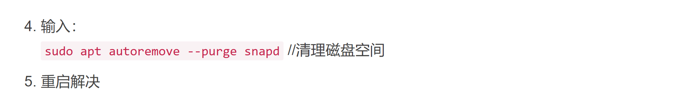

   /***************记录每天学习内容问题点*******************/
2023/9/20
学习内容：搭建BSP开发环境

遇到问题：aarch64-linux-gnu-没有配置好。

问题点：出在etc/profile最后加的路径不对

aarch64-linux-gnu-安装流程：下载安装包--→解压（tar -xvf）--→pwd找到bin文件夹路径--→打开etc/profile--→最后一行加上export PATH=$PAHT:/复制的pwd路径--→source etc/profile--→reboot--→重启后aarch64-linux-gnu- -v获得版本就算成功
公司电脑搭建成功
家里电脑：

/*********************************************************/
2023/9/20
开始学硬件控制这周内容(需要板子，家里学)
/*********************************************************/
2023/10/11
继续学习硬件控制
环境搭建：
VSCODE装 PlatformIO IDE
 

2023/10/20
框架图
CPU框架

I 48 D$ 32 //48K指令和32数据  一级缓存（cache）
L1(2M)  //2MB共享的二级缓存
NEON  //一种基于SIMD(单指令多数据流指令)的arm技术-->矩阵运算、图像处理
GIC  //Generic Interrupt Controller 通用中断控制器 
CoreSight //片内黑匣子 ->不用jtag调试 追踪
          //通过专有的硬件非入侵地实时记录程序执行路径和数据读写信息，然后压缩成Trace数据流
          //恢复程序运行信息后，就可以进行调试和性能分析

总线：
AXI(Advanced eEtensible Interface) //高级可扩展接口（多通道并行）->与GPU FPGA的大数据传输
APB(Advanced Peripehrial Bus) //高举外围总线（单通道）->用于低带宽设备（如uart i2c）
AHB(Advanced Hing Performance Bus) //高级高性能总线（单通道）->高性能高时钟频率场景 
    //如ARM核与内部RAM、NAND FLASH、DMA、Bridge的连接

存储：
PCIE: Peripheral Component Express 周边设备高速互联，连接如WIFI高速设备
EMC: External Memory Controller 接外部存储器（如内存）的接口
MC: Memory Controller 内存控制器模块，处理来自内部客户端的请求并进行仲裁其中分配内存带宽
DDR: Double Data Rate SDRAM: 双倍速率同步动态随机存储器，即内存
LPDDR: Low Power Double Data Rate SDRAM:低功耗双倍数据速率内存
SATA: Serial Advanced Technology Attachment:接硬盘的常用接口

多媒体区：
VI: Video Input 视频输入
VIC:Video Image Compositor 视频图形合成
NVENC: NVIDIA Video Encoder Engine 视频编码引擎
NVDEC: NVIDIA Videod Decoder Engine 视频解码引擎
NVJPG: NVIDIA 的jpg图片的处理
TSEC:  Tegra Security Co-processor 一种嵌入式安全处理器，主要用于管理HDMI链路上的HDCP加密和密钥
ISP: Image Signal Processor 图像信号处理器，是相机处理硬件引擎管道
MIPI: Mobile Industry Processor Interface 移动行业处理器接口（一些移动设备的标准接口）
CSI: Camera Serial Interface 摄像头串行接口
DSI: Display Serial Interface 显示串行接口
eDP: Embedded Display Port 嵌入式显示端口
HDMI High-Definition MUtimedia Interface 高清晰度多媒体接口

2023/10/26
GPIO点灯（在硬件层）
pin 12(丝印) ->I2S0_SCLK  //参考2.1板子标注说明
-> GPIO3_PJ.07 //参考 4.2 40PIN外接管脚的转换表
-> GPIO Controller 3 -Port J //参考3.1CPU芯片手册
-> GPIO_CNF_1 204 //第三组GPIO的J端口的配置寄存器的偏移地址是204

GPIO点灯（在内核层）
分层映射（应用层  内核层  硬件层）
不同的层有不同的地址空间

2023/10/27
sudo insmod led.ko  插入驱动模块
dmesg      查看内核输出日志
sudo rmmod led 卸载驱动模块

通过应用层控制GPIO

sudo insmod led.ko  //插入驱动模块时，查看信息
dmesg //查看内核输出
echo 79> /sys/class/gpio/export  //导出79号gpio引脚，使得可在应用层访问
echo out> /sys/class/gpio/gpio79/direction //设置为输出
echo 1> /sys/class/goio/gpio79/value  //输出高电平 开灯
sudo rmmod led //移除led模块
dmesg   //查看内核输出
echo 0> /sys/class/gpio/gpio79/value  //输出低电平，关灯
sudo insmod led.ko  //插入驱动模块时，查看信息
dmesg   //查看内核输出

2023/11/8

USB架构

网卡工作原理

2023/11/14 串口
配置顺序

参考芯片手册guidline

2023/12/1 Uboot环境变量
#pri   //输入pri的命令，查看uboot环境变量
#setenv ipaddr 192.168.9.33  //设置环境变量
#saveenv   //保存环境变量
#pri   //查看

Uboot常用指令

#pci enum;pci
#tftp u-boot.bin
#go 0x84000000
#md    //memory display
#mw    //memory write 

2023/12/4 I2C

1.BUS Clear 
当从机因未知原因持续拉低SDA,主机收到ARB_LOST(ARB_LOST有很多触发原因，需要确认是因该原因导致的);主机触发BUS Clear operation to recover i2c bus

2023/12/5 Uboot 编译

$ make distclean 
$ make p3450-0000_defconfig  /*配置u-boot为jetson nano板子的  

通过qemu调试
不能在应用层直接运行U-boot和内核   //地址空间不同
但可以用模拟器在应用空间模拟调试

不能用 gdb vmlinux调试内核，因为在应用空间，不能运行内核空间的程序
可以用户模拟器qemu来做，在应用空间模拟一个完整的系统

1.安装qemu 

$ sudo apt-get install qemu-system-arm
$ qemu-system-aarch64 -h //查看全部帮助信息
$ qemu-system-aarch64 --version //查看qemu版本
$ qemu-system-aarch64 -machine help  //查看支持的machine
$qemu-system-aarch64 -cpu help  //查看machine支持的cpu类型

可能存在报错的原因
版本太老，不支持A57 需源码编译
启动内核时会报错

2.源码编译qemu
用ubuntu自己下载的版本太老，选择用源码编译的方式安装最新的

https://www.qemu.org/download/ 下载最新的稳定版本 qemu-6.2.0-rc2.tar.xz 

板子上直接下载：
wget https://download.qemu.org/qemu-6.2.0-rc2.tar.xz
./configure  //配置，会报错，缺少一些软件需要安装

qemu 调试U-boot

下载u-boot.bin
 