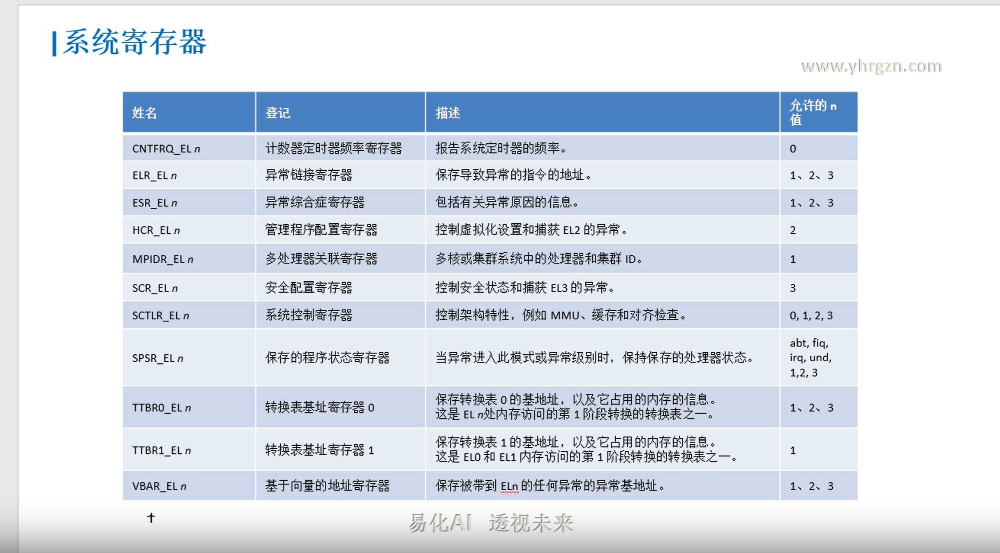

b.ne label //不等时跳转
cbz  w10, 1f //w10值等于0的时候，跳转到1f

ret         //子程序返回指令，返回地址默认保存在LR(X30), 代替了 mov pc ,lr

ldr x0,=_main   //大范围的地址读取，把标号_main(地址)读入x0

adr x0,vector   //小范围的地址读取，把标号vector(地址)读入x0,标号距当前指令PC的偏移小于1M

stp x29,x30,[sp,#-16]!
//入栈，把x29,x30存储到sp-16指向的空间后，sp自减16（因寄存器是8字节，
栈是向下生长，故是-16）

//类似前索引，*（sp-16）=x29,x30 sp=sp-16(!使得sp能自更新)把x29,x30
看成整体

//stp只支持2个寄存器，代替了复杂的stmfd(64位汇编，取消了批量操作指令)

ldp x29,x30,[sp],#16  //出栈：把sp指向的空间内容载入到x29,x30后，sp加16
    //类似后索引：x29,x30=*sp  sp=sp+16

mrs x0,sctlr_el1  //读sctlr_el1内容到x0(注:系统寄存器，都通过mrs,msr来操作)

msr sctlr_el1,x0  //写x0内容到sctlr_el1

svc #2   //系统调用指令(触发一个同步异常,cpu则会陷入EL1)

.global _start  //声明_start为全局符号(让链接脚本能看到)

.quad 0X3FA0    //在存储器中分配8个字节，初值为0x3FA0

.align 4        //2^4=16字节对齐

.macro myAdd, x,y //宏函数，类似 myAdd(x,y)

