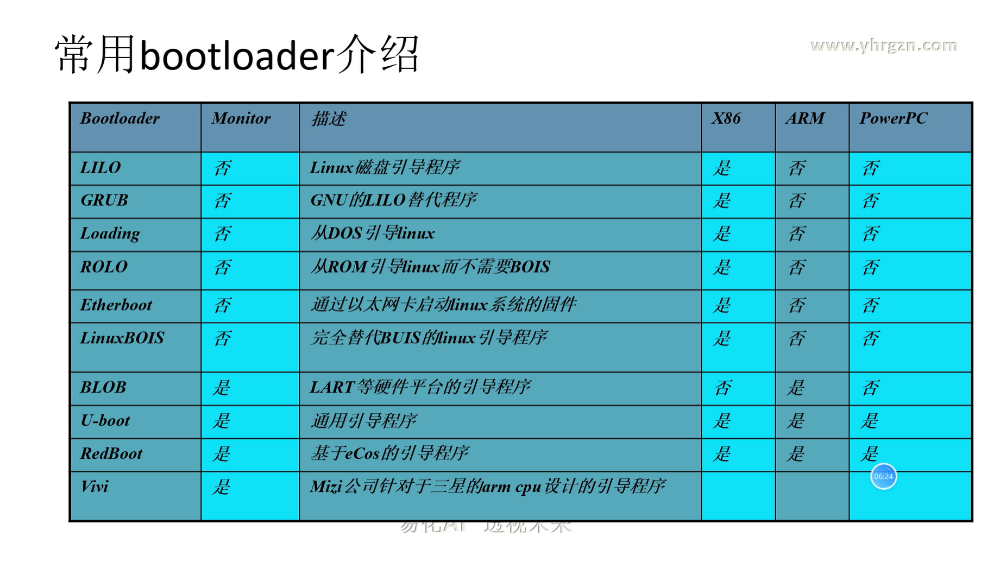
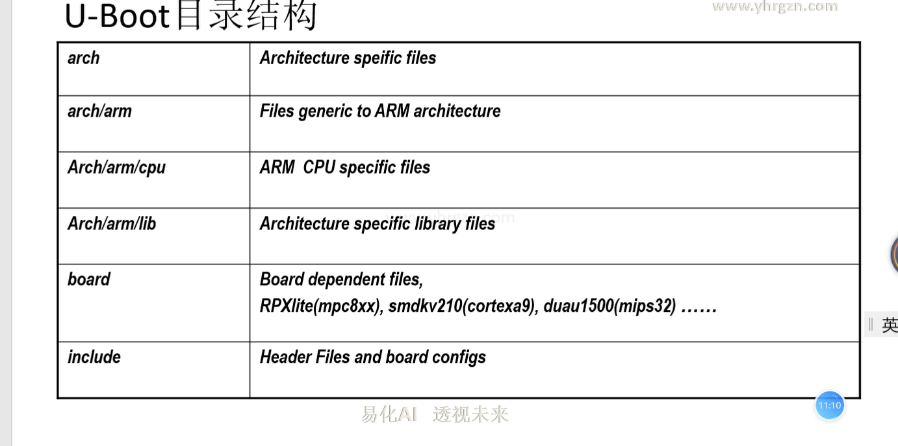
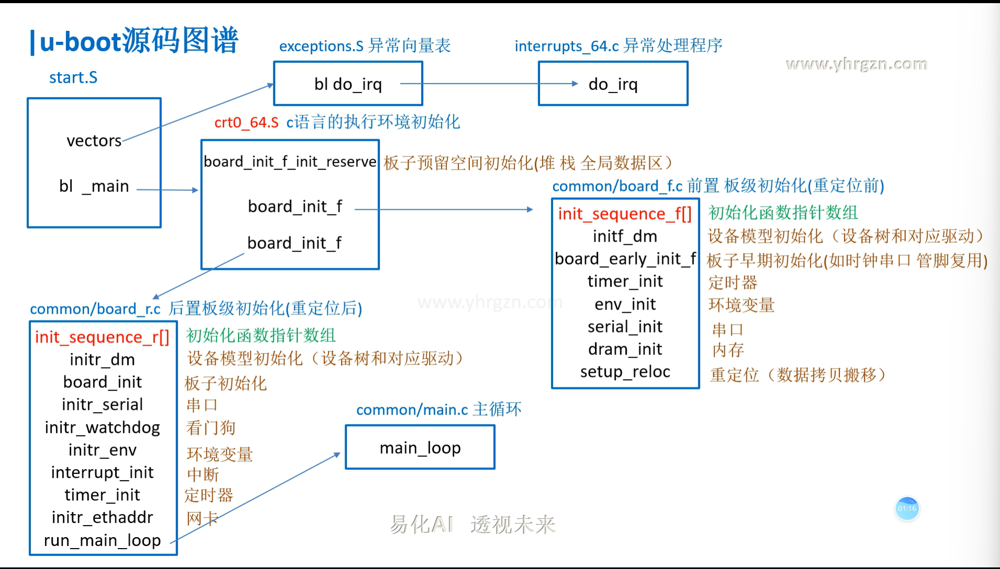

Bootloader不属于操作系统，一般采用汇编语言和C语言开发。需要针对特定的硬件平台编写。

在移植系统时，首先为开发板移植Bootloader。

Bootloader不但依赖CPU的体系结构，而且依赖于嵌入式系统板级设备的配置。

Bootlaoder是硬件启动的引导程序，是运行操作系统的前提；

在操作系统内核或用户应用程序运行之前的一小段代码。对软硬件进行相应的初始化和设定，为最终运行操作系统准备好环境

在嵌入式系统中，整个系统的启动加载任务通常由Bootloader来完成

Bootloader的操作模式：
1.自启动模式：在这种模式下，Bootloader从目标机上的某个固态存储设备上将操作系统加载到RAM中运行，整个过程并没有用户的介入

2.交互模式：在这种模式下，目标机上的Bootloader将通过串口或网络等通信手段从开发主机(Host)上下载内核映像和根文件系统映像等到RAM中。可以被Bootloader写到目标机上的固态存储媒质中，或者直接进行系统的引导。也可以通过串口接收用户的命令。

