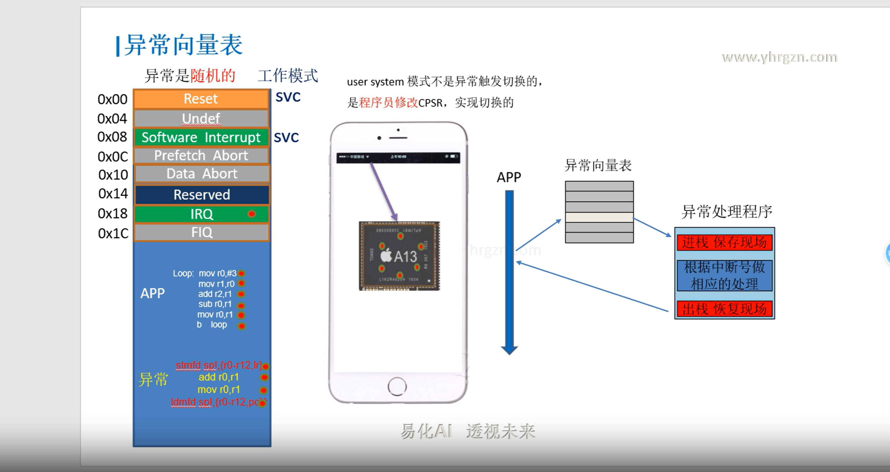

SError  //系统错误

        //最常见的是异步数据终止（例如，由于脏数据从缓存行写回外部存储器而触发中止）

FIQ  //快速中断

    //group 0 or secure interrupts

IRQ  //正常优先级中断

     //group 1(normal) interrupts
    
同步异常

 //是由于指令流的执行或尝试执行而产生的，并且返回地址提供了导致它的指令的详细信息
 
 //如未定义指令，从内存读取数据异常
        